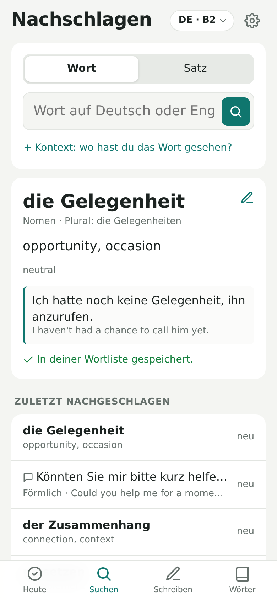
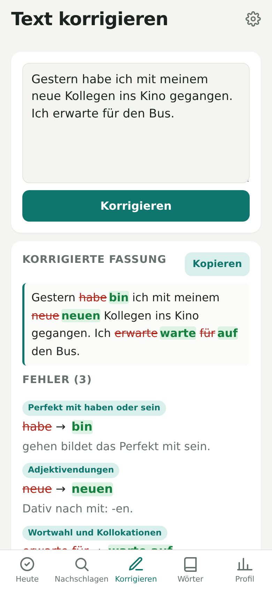
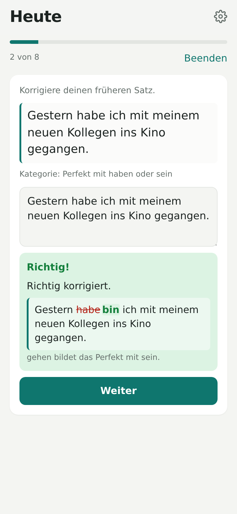
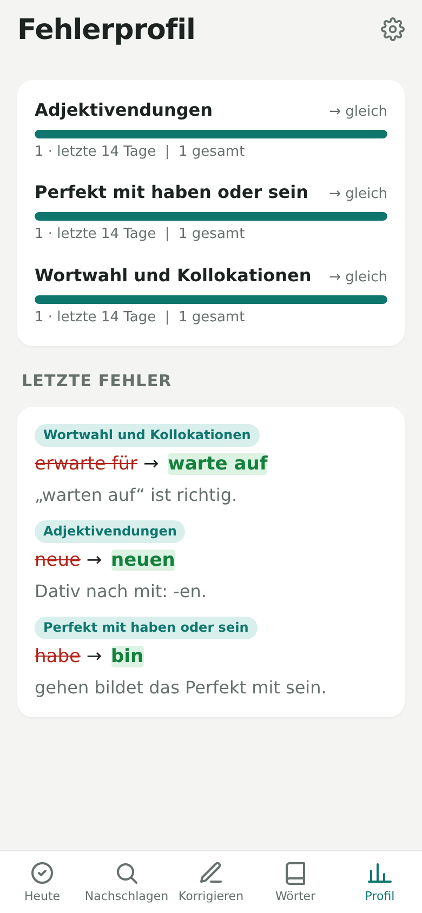

# German Trainer 🇩🇪

**Turn the words you look up and the mistakes you make into daily German practice.**

German Trainer is for learners who understand German well but find it hard to *produce* it. It is a
dictionary, a writing corrector and a daily trainer in one. Every word you look up and every mistake you make
comes back as an exercise until you can produce it correctly yourself.

👉 **Open the app: [ravjot-sk.github.io/german-trainer](https://ravjot-sk.github.io/german-trainer/)**

<table>
  <tr>
    <td></td>
    <td></td>
    <td></td>
    <td></td>
  </tr>
  <tr>
    <td align="center">Look up</td>
    <td align="center">Correct</td>
    <td align="center">Practise</td>
    <td align="center">Track</td>
  </tr>
</table>

---

## Get started in 3 steps

### 1. Install it on your iPhone

1. Open the [app link](https://ravjot-sk.github.io/german-trainer/) in **Safari**.
2. Tap the **Share** button, then **Zum Home-Bildschirm** (Add to Home Screen).
3. Open the app from your home screen. It now runs full-screen, like a normal app.

On a computer, just open the link in any browser.

### 2. Add a free Gemini API key

The app uses Google's Gemini AI to look up words and correct your German. You need your own key, and the
free tier is enough for personal use.

1. Go to [aistudio.google.com/apikey](https://aistudio.google.com/apikey) and sign in with a Google account.
2. Click **Create API key** and copy it.
3. In the app, tap the ⚙️ gear (top right) and paste the key under **Gemini-API-Schlüssel**.
4. Tap **Schlüssel testen**. A green message means you're ready.

Your key is stored only on your device and is sent only to Google.

### 3. Use it every day

- **During the day:** look up words when you meet them, and paste in German you've written.
- **Once a day:** open **Heute** and do your session. It takes about 10 minutes.

---

## What each screen does

### 🔍 Nachschlagen (Look up)

Type a German word, or an English word to find the German one. Gemini gives you the meaning, article,
plural or verb forms, a note on register, and an example sentence.

- **Every lookup is saved to your word list automatically.** There's no extra step.
- Tap **+ Satz hinzufügen** to add the sentence where you found the word. The app picks the right meaning for
  that sentence, and later turns the sentence into a gap-fill exercise.

### ✏️ Korrigieren (Correct)

Paste or write any German: an email, a chat message, a practice paragraph. You get back:

- the corrected text, with every change highlighted,
- each mistake with a short explanation and a grammar category, such as *Adjektivendungen* or
  *Perfekt mit haben oder sein*.

Every mistake is saved to your profile and scheduled for practice. If you picked the wrong word, the right
word goes into your word list too. Tap **Kopieren** to copy the corrected text.

### ✅ Heute (Today)

Your daily session mixes vocabulary and grammar. The app decides what's due using spaced repetition: things
you get right come back after longer and longer gaps, and things you get wrong come back tomorrow.

**Vocabulary.** Every exercise asks you to *produce* German, not just recognise it. Each word moves through
three stages:

| Stage | What you do |
|---|---|
| Recall | See the meaning, type the German word, including the article and plural for nouns |
| Gap fill | Fill the word into the sentence where you found it |
| Write | Write your own sentence with the word, and Gemini checks it |

**Grammar.** This comes from your own mistakes:

| Exercise | What you do |
|---|---|
| Fix your sentence | One of your old sentences comes back, and you correct it |
| Targeted drills | Gemini makes short exercises for your weakest categories: fill in an ending, rewrite a sentence, or write one under a constraint |

Tips:
- If you were right but typed it slightly differently, tap **Ich lag richtig** to count it as correct.
- New words and mistakes join your session **the next day**. You get at most 8 new words a day by default,
  and you can change this in Settings.
- Words and old sentences you get wrong come back once more at the end of the session.

### 📖 Wörter (Words)

All your saved words. Search them, tap one to edit any field, or delete words you don't want to practise.
Tap **＋** to add a word by hand.

### 📊 Profil (Profile)

See which grammar areas trip you up most. For each category you see:

- how often it came up in the **last 14 days**,
- whether it is **improving** (wird besser) or coming up **more often** (häufiger),
- your score in drills for that category.

---

## Settings

Tap the ⚙️ gear (top right).

| Setting | What it does |
|---|---|
| Sprache der App | Switch the app between German and English |
| Konto & Synchronisierung | Sign in to keep your data the same on all your devices (invite only, see below) |
| Gemini-API-Schlüssel | Your API key (see step 2 above) |
| Gemini-Modell | Which Gemini model to use. The default works, and **Modelle laden** shows the others |
| Neue Wörter pro Tag | How many new words join your session each day |
| Sicherung | Export your data to a file, or import it again |

---

## Good to know

**Where is my data?** On your device, in the app itself. If you sign in, it is also kept in your private
account so your other devices get it too. The text you send for lookups and corrections goes to Gemini.
Your Gemini key never leaves the device.

**Back up now and then.** Use **Einstellungen → Sicherung → Exportieren** to save a backup file. You can
**import** that file again later. If you're signed in, your account is already a backup.

**Offline?** Recall, gap fill and "fix your sentence" all work without internet. Lookups, corrections and
exercises that need Gemini wait until you're back online.

**Something not working?**
- *"Bitte zuerst den Gemini-Schlüssel eintragen"*: add your key in Settings.
- *"Gemini-Fehler: …"*: tap **Schlüssel testen** in Settings. If the model isn't found, tap
  **Modelle laden** and pick a "flash" model.
- *The app looks out of date*: close it and open it again. Updates load in the background.

---

## Accounts and sync

Accounts are optional and invite only. Without one, the app works exactly as before, with data on the
device only.

1. In **Einstellungen → Konto & Synchronisierung**, enter your email and a password and tap
   **Konto erstellen**.
2. Open the confirmation link in the email you get, then tap **Ich habe bestätigt** in the app.
3. If your email hasn't been invited yet, ask the app's owner to invite it, then tap **Erneut prüfen**.
4. On your other devices, tap **Anmelden** with the same email and password.

The first time you sign in, everything already on that device is added to your account. Changes you make
offline are sent once you're back online. **Abmelden** removes your data from that device; it stays in your
account and comes back when you sign in again.

### Setting up Firebase (app owner, one time)

Sync uses a free Firebase project. Until it's set up, the account card says accounts aren't set up yet.

1. Go to [console.firebase.google.com](https://console.firebase.google.com), sign in with your Google
   account and create a project (Google Analytics is not needed).
2. **Build → Authentication → Get started → Sign-in method → Email/Password**: turn on the first switch
   (Email/Password, not the email link) and save.
3. **Build → Firestore Database → Create database**: pick a location near you (for example
   `europe-west3`, Frankfurt) and start in **production mode**.
4. In Firestore, open the **Rules** tab, replace everything with the contents of
   [`firestore.rules`](firestore.rules), and tap **Publish**.
5. **Project settings (⚙️) → General → Your apps → Web (`</>`)**: register an app called German Trainer
   (no Firebase Hosting). Copy the `firebaseConfig` values it shows into
   [`js/firebase-config.js`](js/firebase-config.js) in place of `null`, and push that to `main`. These
   values aren't secret; the rules decide who can read what.

**Inviting someone:** in **Firestore Database → Data**, start a collection called `allowlist` (first
time only), then add a document whose **Document ID** is their email address in lowercase, for example
`ravi@example.com`. Give it any field, for example `name` = their name. Invite yourself the same way.
To remove someone's access, delete their document.

Everyone's data is private: each person can only read and write their own, and Firebase's free plan is
plenty for a small group.

---

## For developers

Plain HTML, CSS and JavaScript modules. There is no build step and no dependencies. The Firebase SDK is
loaded from Google's CDN only when sync is configured.

```sh
npm start   # serve locally at http://localhost:8080
npm test    # unit tests: scheduler, answer checking, session building, sync merging
```

| File | What's in it |
|---|---|
| `js/app.js` | Screens and navigation |
| `js/gemini.js` | All Gemini prompts and their JSON response schemas |
| `js/session.js` | Builds the daily mixed session |
| `js/srs.js` | Spaced-repetition scheduler (SM-2 variant) |
| `js/check.js` | Local answer checking and the correction diff |
| `js/categories.js` | The fixed list of grammar categories |
| `js/store.js` | Local storage: `words`, `mistakes`, `reviewItems`, `reviews` |
| `js/sync.js` | Accounts and sync: mirrors local data to Firestore `users/{uid}/…` and merges other devices' changes |
| `js/syncmerge.js` | Merge rules: per-record "latest edit wins", deletes as tombstones |
| `js/firebase-config.js` | Firebase project config (`null` turns accounts off) |
| `firestore.rules` | Security rules: invite-only allowlist, each user sees only their own data |
| `js/i18n.js` | German and English UI text |
| `sw.js` | Service worker for offline use |

The app is hosted on GitHub Pages from the `main` branch. Anything merged to `main` goes live within a
minute or two.

## License

MIT, see [LICENSE](LICENSE).
