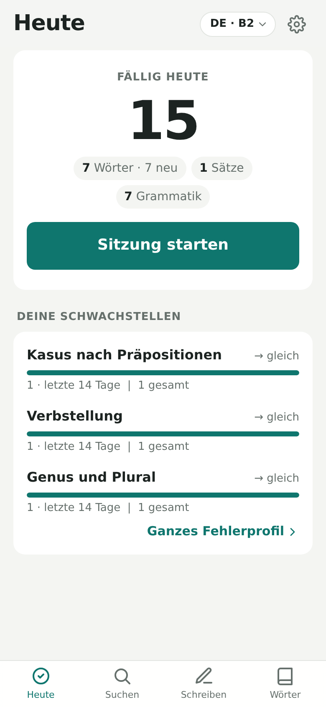

# Language Trainer 🇩🇪 🇯🇵

**Turn the words you look up and the mistakes you make into daily practice, in German, Japanese or any other language.**

Language Trainer is for learners who understand a language better than they can *produce* it. It is a
dictionary, a writing corrector and a daily trainer in one. Every word you look up and every mistake you make
comes back as an exercise until you can produce it correctly yourself. German and Japanese are built in, and
Gemini sets up any other language you add.

👉 **Open the app: [ravjot-sk.github.io/german-trainer](https://ravjot-sk.github.io/german-trainer/)**

<table>
  <tr>
    <td></td>
    <td></td>
    <td></td>
    <td></td>
  </tr>
  <tr>
    <td align="center">Look up</td>
    <td align="center">Correct</td>
    <td align="center">Practise</td>
    <td align="center">Track</td>
  </tr>
</table>

---

## Get started in 3 steps

### 1. Install it on your iPhone

1. Open the [app link](https://ravjot-sk.github.io/german-trainer/) in **Safari**.
2. Tap the **Share** button, then **Zum Home-Bildschirm** (Add to Home Screen).
3. Open the app from your home screen. It now runs full-screen, like a normal app.

On a computer, just open the link in any browser.

### 2. Add a free Gemini API key

The app uses Google's Gemini AI to look up words and correct your German. You need your own key, and the
free tier is enough for personal use.

1. Go to [aistudio.google.com/apikey](https://aistudio.google.com/apikey) and sign in with a Google account.
2. Click **Create API key** and copy it.
3. In the app, tap the ⚙️ gear (top right) and paste the key under **Gemini-API-Schlüssel**.
4. Tap **Schlüssel testen**. A green message means you're ready.

Your key is stored only on your device and is sent only to Google.

### 3. Choose your language and level

The first time you open the app, pick the language you're learning and your level (A1–C2, or JLPT N5–N1
for Japanese). Nothing is preset: every exercise, example and explanation is pitched at the level you choose,
and you can change it any time in Settings.

- **German and Japanese** are built in, each with its own hand-written list of grammar categories.
- **Any other language:** choose **+ Andere Sprache …** and type its name, for example *Spanish*. Gemini sets
  it up once (articles, readings, and the 8–10 grammar areas learners of that language get wrong most).
- You can learn several languages. Words, mistakes and progress are kept separate for each one; switch in
  Settings or with the language pill (for example **DE · B2**) at the top. Your levels sync with your account; which language is active is chosen on each device.

**Japanese:** type with the iPhone Japanese keyboard. Words are saved with their kana reading, and in recall
the kanji form is correct while typing only the reading counts as *almost*. Lookups also accept romaji.
Words, example sentences, saved sentences and drills show furigana above the kanji. In **Settings › Furigana**
choose *Tap* (readings appear when you tap the text, so you try reading first; the default), *Always* or *Off*.
Sentences saved before furigana existed get theirs from Gemini the first time they come up.

### 4. Use it every day

- **During the day:** look up words when you meet them, and paste in text you've written.
- **Once a day:** open **Heute** and do your session. It takes about 10 minutes.

---

## What each screen does

### 🔍 Suchen (Look up)

Type a word in the language you're learning, or an English word to find it. Gemini gives you the meaning,
article, plural or key forms (the reading for Japanese), a note on register, and an example sentence.

- **Every lookup is saved to your word list automatically.** There's no extra step.
- Tap **+ Kontext** to add the sentence where you found the word. The app picks the right meaning for
  that sentence, and later turns the sentence into a gap-fill exercise.

**Whole sentences.** Switch to **Satz** to translate a sentence (typed in English or in the language you're
learning) and pick a tone:

| Tone | When to use it |
|---|---|
| Alltag (everyday) | How people really talk day to day. This is the default. |
| Förmlich (formal) | Polite and professional: officials, work, people you don't know (Sie, keigo) |
| Informell (informal) | Casual, with friends and family (du, plain form) |

You get the translation, a one-line note on what makes it sound that way, and the useful words in it. Tap
a word to save it too. The sentence is saved automatically and joins your daily practice.

### ✏️ Schreiben (Correct)

Paste or write anything in the language you're learning: an email, a chat message, a practice paragraph.
You get back:

- the corrected text, with every change highlighted,
- each mistake with a short explanation and a grammar category, such as *Adjektivendungen* in German or
  *Particles* in Japanese.

Every mistake is saved to your profile and scheduled for practice. If you picked the wrong word, the right
word goes into your word list too. Tap **Kopieren** to copy the corrected text.

If your text is correct but could sound more natural, you also see **Natürlicher klingt es so** with a better
phrasing and why. That's a suggestion, not a mistake. Tap **Zum Üben speichern** to add it to your sentences.

After a correction the result comes first and your text folds into one line; tap it to edit and correct again,
or tap **Neuer Text** to start over.

### ✅ Heute (Today)

Shows what's due today and your three weakest grammar areas (tap **Ganzes Fehlerprofil** for the full
profile, see below). Your daily session mixes vocabulary and grammar. The app decides what's due using spaced repetition: things
you get right come back after longer and longer gaps, and things you get wrong come back tomorrow.

**Vocabulary.** Every exercise asks you to *produce* the language, not just recognise it. Each word moves through
three stages:

| Stage | What you do |
|---|---|
| Recall | See the meaning and type the word: for German nouns with article and plural, for Japanese in kanji |
| Gap fill | Fill the word into the sentence where you found it |
| Write | Write your own sentence with the word, and Gemini checks it |

**Sentences.** Saved sentences rotate through three exercises:

| Exercise | What you do |
|---|---|
| Say it | See the English and the tone, and write the sentence. Gemini checks it, so any correct phrasing counts. Using a different tone is never a mistake: you only get a tip on how it's usually said. |
| Put it in order | Tap the shuffled pieces back into the right order (works offline) |
| Fill the gap | Fill in the sentence's key expression |

After "write a sentence" and "say it", you may also see a more natural phrasing that you can save.

**Grammar.** This comes from your own mistakes:

| Exercise | What you do |
|---|---|
| Fix your sentence | One of your old sentences comes back, and you correct it |
| Targeted drills | Gemini makes short exercises for your weakest categories: fill in an ending, rewrite a sentence, or write one under a constraint |

Tips:
- If you were right but typed it slightly differently, tap **Ich lag richtig** to count it as correct.
- New words and mistakes join your session **the same day** you add them. You get at most 8 new words a day by default,
  and you can change this in Settings. New sentences have their own limit of 3 a day.
- Words and old sentences you get wrong come back once more at the end of the session.

### 📖 Wörter (Words)

All your saved words and sentences, with a filter to show only one kind. Search them, tap one to edit any field, or delete words you don't want to practise.
Tap **+** to add a word by hand. Rarely needed fields (register, example, gap sentence) are under **Mehr Felder**.

### 📊 Fehlerprofil (Profile)

Open it from **Heute** → **Ganzes Fehlerprofil**. See which grammar areas trip you up most. For each category you see:

- how often it came up in the **last 14 days**,
- whether it is **improving** (wird besser) or coming up **more often** (häufiger),
- your score in drills for that category.

---

## Settings

Tap the ⚙️ gear (top right).

| Setting | What it does |
|---|---|
| Ich lerne / Mein Niveau | The language you're practising and your level in it; add another language here |
| Sprache der App | Switch the app's own buttons and explanations between German and English |
| Konto & Synchronisierung | Sign in to keep your data the same on all your devices (invite only, see below) |
| Gemini-API-Schlüssel | Your API key (see step 2 above) |
| Erweitert → Gemini-Modell | Which Gemini model to use. The default works, and **Modelle laden** shows the others |
| Neue Wörter pro Tag | How many new words join your session each day |
| Sicherung | Export your data to a file, or import it again |

---

## Good to know

**Where is my data?** On your device, in the app itself. If you sign in, it is also kept in your private
account so your other devices get it too. The text you send for lookups and corrections goes to Gemini.
Your Gemini key never leaves the device.

**Back up now and then.** Use **Einstellungen → Sicherung → Exportieren** to save a backup file. You can
**import** that file again later. If you're signed in, your account is already a backup.

**Offline?** Recall, gap fill and "fix your sentence" all work without internet. Lookups, corrections and
exercises that need Gemini wait until you're back online.

**Something not working?**
- *"Bitte zuerst den Gemini-Schlüssel eintragen"*: add your key in Settings.
- *"Gemini-Fehler: …"*: tap **Schlüssel testen** in Settings. If the model isn't found, open **Erweitert**,
  tap **Modelle laden** and pick a "flash" model.
- *The app looks out of date*: close it and open it again. Updates load in the background.

---

## Accounts and sync

Accounts are optional and invite only. Without one, the app works exactly as before, with data on the
device only.

1. In **Einstellungen → Konto & Synchronisierung**, enter your email and a password and tap
   **Konto erstellen**.
2. Open the confirmation link in the email you get, then tap **Ich habe bestätigt** in the app.
3. If your email hasn't been invited yet, ask the app's owner to invite it, then tap **Erneut prüfen**.
4. On your other devices, tap **Anmelden** with the same email and password.

The first time you sign in, everything already on that device is added to your account. Changes you make
offline are sent once you're back online. **Abmelden** removes your data from that device; it stays in your
account and comes back when you sign in again.

### Setting up Firebase (app owner, one time)

Sync uses a free Firebase project. Until it's set up, the account card says accounts aren't set up yet.

1. Go to [console.firebase.google.com](https://console.firebase.google.com), sign in with your Google
   account and create a project (Google Analytics is not needed).
2. **Build → Authentication → Get started → Sign-in method → Email/Password**: turn on the first switch
   (Email/Password, not the email link) and save.
3. **Build → Firestore Database → Create database**: pick a location near you (for example
   `europe-west3`, Frankfurt) and start in **production mode**.
4. In Firestore, open the **Rules** tab, replace everything with the contents of
   [`firestore.rules`](firestore.rules), and tap **Publish**. Do this again whenever `firestore.rules`
   changes (it did when languages were added).
5. **Project settings (⚙️) → General → Your apps → Web (`</>`)**: register an app called German Trainer
   (no Firebase Hosting). Copy the `firebaseConfig` values it shows into
   [`js/firebase-config.js`](js/firebase-config.js) in place of `null`, and push that to `main`. These
   values aren't secret; the rules decide who can read what.

**Inviting someone:** in **Firestore Database → Data**, start a collection called `allowlist` (first
time only), then add a document whose **Document ID** is their email address in lowercase, for example
`ravi@example.com`. Give it any field, for example `name` = their name. Invite yourself the same way.
To remove someone's access, delete their document.

Everyone's data is private: each person can only read and write their own, and Firebase's free plan is
plenty for a small group.

---

## For developers

Plain HTML, CSS and JavaScript modules. There is no build step and no dependencies. The Firebase SDK is
loaded from Google's CDN only when sync is configured.

```sh
npm start   # serve locally at http://localhost:8080
npm test    # unit tests: scheduler, answer checking, languages, session building, sync merging
```

| File | What's in it |
|---|---|
| `js/app.js` | Screens and navigation |
| `js/gemini.js` | All Gemini prompts and their JSON response schemas |
| `js/session.js` | Builds the daily mixed session |
| `js/srs.js` | Spaced-repetition scheduler (SM-2 variant) |
| `js/check.js` | Local answer checking and the correction diff |
| `js/languages.js` | Built-in languages (German, Japanese), levels, and per-language helpers |
| `js/categories.js` | The fixed grammar categories for each language |
| `js/store.js` | Local storage: `words`, `mistakes`, `reviewItems`, `reviews`, `languages` |
| `js/sync.js` | Accounts and sync: mirrors local data to Firestore `users/{uid}/…` and merges other devices' changes |
| `js/syncmerge.js` | Merge rules: per-record "latest edit wins", deletes as tombstones |
| `js/firebase-config.js` | Firebase project config (`null` turns accounts off) |
| `firestore.rules` | Security rules: invite-only allowlist, each user sees only their own data |
| `js/i18n.js` | German and English UI text |
| `sw.js` | Service worker for offline use |

The app is hosted on GitHub Pages from the `main` branch. Anything merged to `main` goes live within a
minute or two.

## License

Copyright (C) 2026 ravjot-sk

This program is free software: you can redistribute it and/or modify it under the terms of the GNU General
Public License as published by the Free Software Foundation, either version 3 of the License, or (at your
option) any later version. See [LICENSE](LICENSE) for the full text.
